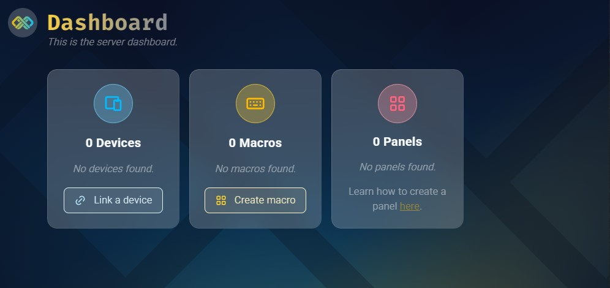

# Getting started

#### Macrame is a small application that can be used to record macros and play those same macros through button panels.

---

::: warning
**This application is currently in beta on Windows only.**

Run this application at your own risk. It shouldn't break anything, but at this stage it might.

**Never run this application on a public network! Only run this on a secured LAN network!**
:::
&nbsp;

1. **Download** the latest build from the [Macrame Github Page](https://github.com/jaxxmoss/macrame).

2. Unzip the contents in whatever place you prefer.

3. Run the **install.bat** as an **administrator**.

_This will add Macrame.exe as an exception in the firewall. And run the Setup.exe, which will generate a config.js inside the public folder_

4. Macrame will start automatically.

_For now the program runs in a commandprompt. It will become a tray icon in the future._

5. If everything went right the application will open the application in the default browser and you should see something like this:

   

&nbsp;

Now you can start with [linking a remote device](/devices/linking) or [record a macro](/macro/recording)!

Panel creation can not be done in the app read the [Panel creation page](/panels/creation) for more information.

---
